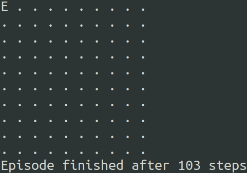
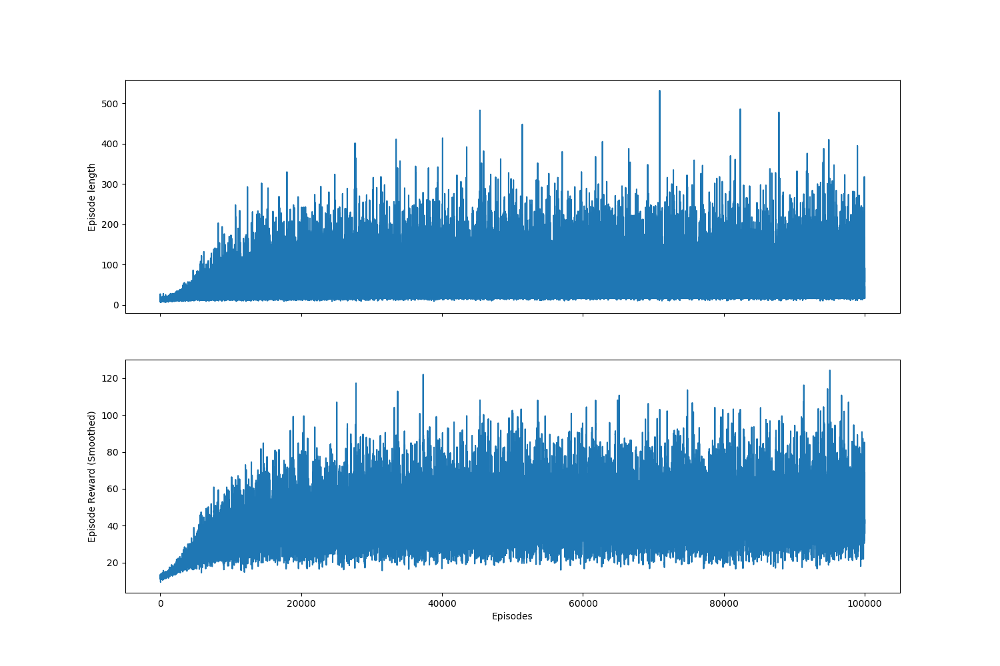

# How to train your Q-function

...or a small exercise in reinforcement learning

## What is this

This is a project that creates a simple environment without dependencies like OpenAI Gym, 
and implements [Q-learning algorithm](https://en.wikipedia.org/wiki/Q-learning) using the environment. 
The result is the trained agent `A` that tries to avoid the enemies `E`:



## The environment

The rules are:
1. The field is square, parameterized by the side length;
2. Enemies can go in 4 directions: left, right, up and down;
3. The agent can go in 8 directions left, up-left, up, ... down-left, or stay still;
4. The game episode is finished, if any enemy catches the agent; 
5. There are no collisions between enemies.

 
## Installation

You need python3, I'd suggest to use [virtualenv](https://www.pythonforbeginners.com/basics/how-to-use-python-virtualenv).
Create the virtual environment and install the dependencies there:
```bash
virtualenv -p python3 venv
source venv/bin/activate
pip install -r requirements.txt 
```

Then you can evaluate the model
```bash
python main.py -e
```

... or train and evaluate it
```bash
python main.py
```
It takes time, and as a result will produce files `current-graph.png` and `current-qfunc.pkl`, the
last one is the data structure to calculate Q-function, that the agent may use. The graph looks like this:
 

## Credits

Thanks to [kismir](https://habr.com/ru/users/kismir/) for the idea of the environment, 
it is taken from the article https://habr.com/ru/post/345656/ 
